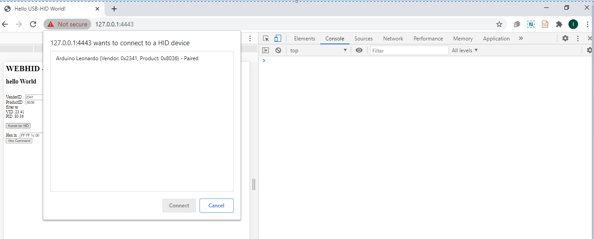
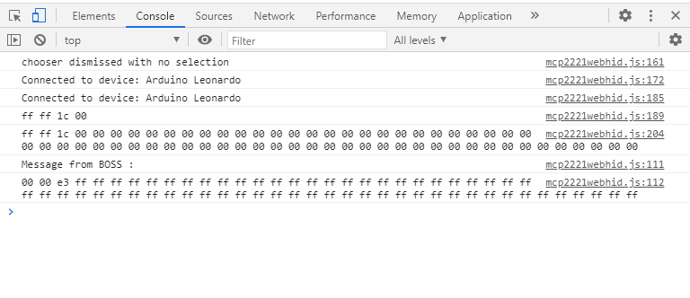

##simple WEB HID Arduino Pro Micro 

ujicoba akses WEBHID ke microcontroller Arduino Pro Micro (ATMegaU24).


<p align="center">
  
</p>


Library arduino HID menggunakan :

https://github.com/NicoHood/HID

Informasi penting adalah adanya pengamanan pada chrome yang mencegah akses WEBHID ke device
dengan USAGE_PAGE dan USAGE tertentu. Disampaikan pada :


https://github.com/WICG/webhid/issues/12

dan 

https://source.chromium.org/chromium/chromium/src/+/master:services/device/public/cpp/hid/hid_usage_and_page.cc;l=9

```
bool IsAlwaysProtected(const mojom::HidUsageAndPage& hid_usage_and_page) {
  const uint16_t usage = hid_usage_and_page.usage;
  const uint16_t usage_page = hid_usage_and_page.usage_page;

  if (usage_page == mojom::kPageKeyboard)
    return true;

  if (usage_page != mojom::kPageGenericDesktop)
    return false;

  if (usage == mojom::kGenericDesktopPointer ||
      usage == mojom::kGenericDesktopMouse ||
      usage == mojom::kGenericDesktopKeyboard ||
      usage == mojom::kGenericDesktopKeypad) {
    return true;
  }

  if (usage >= mojom::kGenericDesktopSystemControl &&
      usage <= mojom::kGenericDesktopSystemWarmRestart) {
    return true;
  }

  if (usage >= mojom::kGenericDesktopSystemDock &&
      usage <= mojom::kGenericDesktopSystemDisplaySwap) {
    return true;
  }

  return false;
}
```

lalu ada contoh berhasil dari luni, pada 
https://forum.pjrc.com/threads/60782-Making-WebUSB-Work-with-the-Teensy-What-is-PluggableUSB?p=249316

dengan WEBHID tester.

dari informasi-informasi di atas, saya mencoba mengembangkan ujicoba WEBHID sederhana.

akses aplikasi web mengharuskan akses HTTPS, sehingga diperlukan simplehttps server. 
disini python sangat memudahkan untuk membuat web server HTTPS .

```
python.exe simplehttps.py
```

aktifkan fitur experimental WEBHID pada chrome dengan meng-akses :

chrome://flags/#enable-experimental-web-platform-features

akses ke web ujicoba WEBHID, dengan tampilan awal :

[screenshot01.png]
<p align="center">
  
</p>

ujicoba WEBHID terdiri dari dua fungsi penting,
yaitu await device.sendReport(outputReportId,outputReport ); untuk mengirimkan 64byte perintah ke Arduino

dan
```
device.oninputreport = onInputReport;
.
.
.
function onInputReport(event) {
	    let dv = event.data

   console.log('Message from BOSS :');
   console.log(buf2hex(dv.buffer))

}
```
yang memproses event pengiriman data dari Arduino ke WEBHID.

pemicu proses pengiriman data dari Arduino ke WEBHID yaitu dengan membuat kondisi HIGH pin nomor 9.

[screenshot01.png]
<p align="center">
  
</p>
